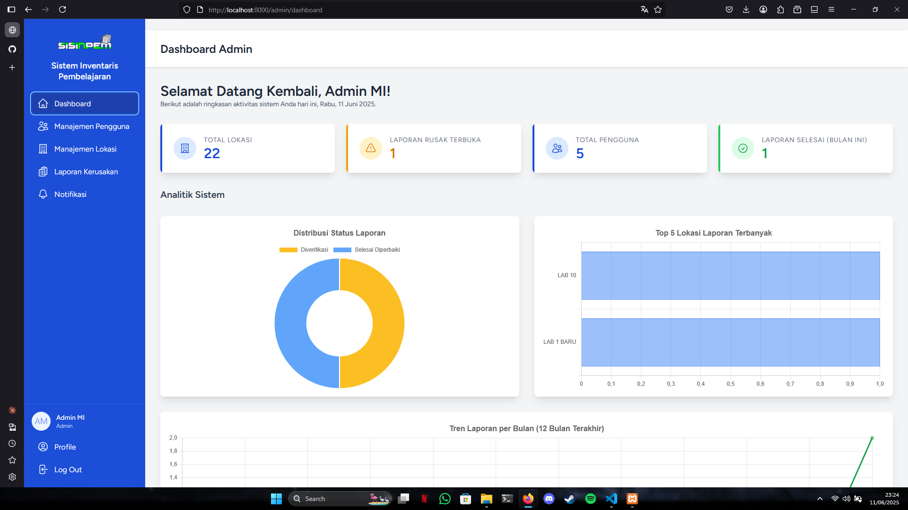

<p align="center">
  
</p>

<h1 align="center">🚀 SISINPEM - Sistem Informasi Inventaris Pembelajaran 🚀</h1>

<p align="center">
  <strong>Kelola Aset Pembelajaran Berbasis Lokasi dengan Cerdas, Efisien, dan Modern!</strong><br>
  Dibangun dengan ❤️ oleh Kelompok 2 MIC2023 untuk tujuan pembelajaran.
</p>

<p align="center">
  
  
  
  
  
</p>

## 👋 Selamat Datang di SISINPEM!

Kesulitan melacak kondisi aset penting di berbagai lokasi pembelajaran seperti laboratorium atau ruang kelas? SISINPEM hadir sebagai solusi! Aplikasi web inovatif ini dirancang khusus untuk institusi pendidikan yang ingin memodernisasi cara pengelolaan lokasi dan pelaporan kerusakan aset. Lupakan kerumitan pencatatan manual dan sambut era digital pengelolaan inventaris yang terintegrasi.

Dilengkapi dengan **notifikasi otomatis** untuk setiap laporan kerusakan baru, SISINPEM memastikan semua pihak terkait selalu mendapatkan informasi terkini secara _real-time_.

✨ **Catatan:** Untuk pengalaman pengguna terbaik dan akses ke semua fitur manajemen, kami sangat merekomendasikan penggunaan SISINPEM pada perangkat desktop.

## 📸 Pratinjau Aplikasi

Berikut adalah tangkapan layar dari antarmuka aplikasi SISINPEM:

<p align="center">
  
</p>

## 🌟 Fitur Unggulan

SISINPEM dikemas dengan fitur-fitur canggih untuk memaksimalkan efisiensi Anda:

### 👨‍💻 Fitur Administrator

-   **Dashboard Interaktif:** Pantau denyut nadi inventaris Anda dengan statistik kunci jumlah lokasi, progres laporan kerusakan, dan ringkasan pengguna dalam satu tampilan dinamis.
-   **Manajemen Lokasi Terperinci:** Kendalikan setiap lokasi dengan operasi CRUD (Create, Read, Update, Delete) yang lengkap, termasuk fitur unggah gambar, nama lokasi, kapasitas, dan deskripsi aset.
-   **Manajemen Laporan Kerusakan:** Tangani laporan kerusakan, perbarui statusnya secara _real-time_, tambahkan catatan penting, dan lihat detail lengkap termasuk bukti foto.
-   **Pusat Notifikasi:** Lihat daftar notifikasi sistem, tandai sudah dibaca, dan kelola riwayat notifikasi Anda dengan mudah.
-   **Manajemen Pengguna Terpusat:** Administrator sistem memiliki kontrol penuh untuk membuat dan mengelola akun pengguna (Admin dan Mahasiswa).

### 🧑‍🎓 Fitur Mahasiswa

-   **Dashboard Personal:** Lihat ringkasan laporan kerusakan yang pernah Anda buat dan akses cepat ke fitur-fitur penting.
-   **Eksplorasi Lokasi:** Cari dan filter daftar lokasi yang tersedia dengan cepat dan mudah.
-   **Pelaporan Kerusakan Instan:** Laporkan kerusakan secara detail dengan memilih lokasi, tipe kerusakan, deskripsi, dan mengunggah foto sebagai bukti.

## 🏗️ Arsitektur & Alur Kerja Utama

### Struktur Direktori Kunci

-   `app/Livewire`: Berisi semua komponen dinamis Livewire yang menjadi inti dari antarmuka pengguna.
-   `app/Services`: Lapisan servis untuk memisahkan logika bisnis dari komponen (contoh: `DamageReportService`).
-   `app/Models`: Model Eloquent yang merepresentasikan tabel database (`User`, `Location`, `DamageReport`).
-   `app/Observers`: Observer untuk menangani _event_ pada model, seperti membuat notifikasi saat laporan baru dibuat.
-   `resources/views/`: Berisi semua file Blade, termasuk layout, komponen, dan halaman Livewire.

### Alur Kerja Pelaporan Kerusakan

1.  **Mahasiswa** masuk ke sistem.
2.  Mengakses menu untuk membuat laporan kerusakan baru.
3.  Mengisi formulir dengan detail kerusakan (lokasi, deskripsi, foto).
4.  Setelah laporan dikirim, `DamageReportObserver` secara otomatis membuat notifikasi untuk semua **Admin**.
5.  **Admin** menerima notifikasi di dashboard mereka.
6.  Admin membuka halaman manajemen laporan, melihat detail, dan mengubah statusnya (misal: "Diverifikasi", "Selesai").
7.  **Mahasiswa** dapat melihat pembaruan status laporannya di halaman "Laporan Saya".

## 🛠️ Teknologi yang Digunakan

-   **Framework Backend:** Laravel 11
-   **Framework Frontend Dinamis:** Livewire 3
-   **Sistem Autentikasi & UI:** Laravel Jetstream
-   **Styling:** Tailwind CSS
-   **Ikon:** Heroicons (via `blade-ui-kit/blade-heroicons`)
-   **Database:** MySQL
-   **PHP:** Versi 8.2+
-   **Manajemen Dependensi:** Composer (PHP), NPM (JavaScript)

## 🚀 Panduan Instalasi Cepat

Ikuti langkah-langkah ini untuk menjalankan SISINPEM di lingkungan lokal Anda:

1.  **Clone Repositori:**
    ```bash
    git clone [https://github.com/wahyu2021/sistem-inventaris-pembelajaran.git](https://github.com/wahyu2021/sistem-inventaris-pembelajaran.git) sisinpem && cd sisinpem
    ```
2.  **Instal Dependensi PHP:**
    ```bash
    composer install
    ```
3.  **Salin File Environment:**
    ```bash
    cp .env.example .env
    ```
4.  **Generate Kunci Aplikasi:**
    ```bash
    php artisan key:generate
    ```
5.  **Konfigurasi Database:** Atur koneksi database Anda di file `.env`.
6.  **Jalankan Migrasi Database:**
    ```bash
    php artisan migrate
    ```
7.  **(Opsional) Jalankan Seeder untuk Akun Awal:**
    ```bash
    php artisan db:seed
    ```
8.  **Instal Dependensi Frontend & Compile Aset:**
    ```bash
    npm install && npm run dev
    ```
9.  **Buat Symbolic Link untuk Storage:**
    ```bash
    php artisan storage:link
    ```
10. **Jalankan Server Pengembangan:**
    ```bash
    php artisan serve
    ```
11. **(Opsional) Jalankan Queue Worker untuk Notifikasi:**
    ```bash
    php artisan queue:work
    ```

🎉 Aplikasi Anda sekarang siap diakses di `http://localhost:8000`! 🎉

## 🧪 Pengujian (Testing)

Proyek ini dilengkapi dengan serangkaian tes otomatis untuk memastikan setiap komponen berfungsi dengan baik. Untuk menjalankan semua tes, gunakan perintah Artisan berikut:

```bash
php artisan test
```

## 💡 Cara Menggunakan

-   Buka aplikasi di browser Anda (`http://localhost:8000`).
-   **Login Akun:**
    -   🔒 **Penting:** Tidak ada fitur pendaftaran publik. Semua akun (Admin dan Mahasiswa) harus dibuat oleh Administrator melalui menu **Manajemen Pengguna**.
    -   **Akun Admin Default (jika seeder dijalankan):**
        -   Email: `test@example.com`
        -   Password: `password`

## 🤝 Panduan Kontribusi

Kami sangat terbuka untuk kontribusi! Jika Anda ingin membantu, silakan:

1.  **Fork** repositori ini.
2.  Buat **Branch** baru untuk setiap fitur atau perbaikan (`git checkout -b fitur/nama-fitur`).
3.  Lakukan perubahan dan pastikan semua tes (`php artisan test`) berjalan lancar.
4.  Buat **Pull Request** dengan penjelasan yang jelas mengenai perubahan yang Anda buat.

Untuk diskusi atau laporan bug, silakan buat **Issue** baru di laman GitHub proyek.

## 📜 Lisensi

Proyek ini dirilis di bawah [Lisensi MIT](https://opensource.org/licenses/MIT).

## 🙏 Ucapan Terima Kasih

Proyek ini merupakan hasil karya dan dedikasi untuk pembelajaran dari:
**Kelompok 2 MIC Angkatan 2023**
